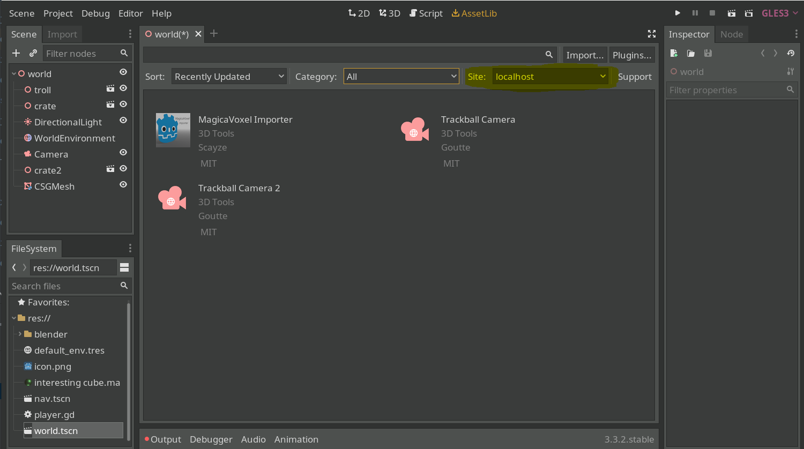
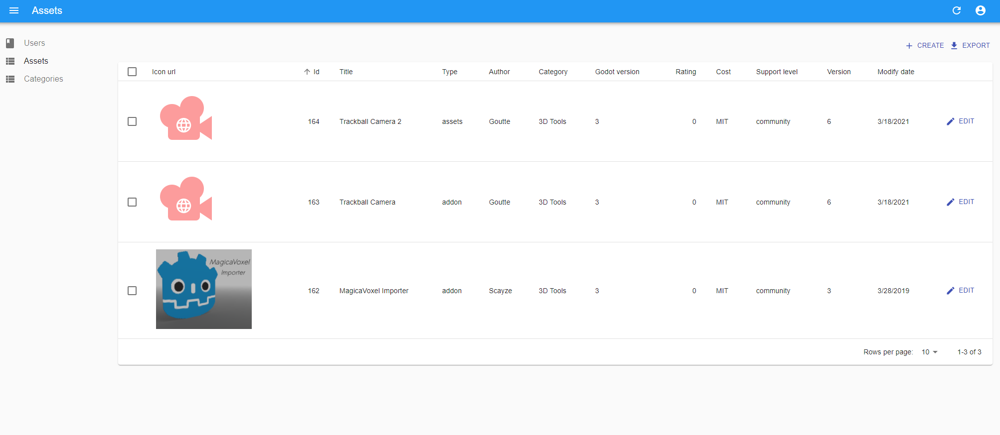

# Custom Godot AssetLib for plugins

This repository contains a prototype (or starting code) for a working backend and frontend implementation for a custom AssetLib for Godot.

Godot has an AssetLib tab for it to connect to its own official repository of plugins or assets, but Godot also allows for anyone to create their own custom "asset store" to connect to the AssetLib tab of the Godot game engine. Following how the engine expects the api to be, I've developed this repository so that people can try out building their own repository.

To use the repo, read the [README of the backend](./backend/README.md) to see how to start up the python backend. With that, your api will be up and the `localhost` mode of godot should read from the dummy data configured in it. Similarly, use the [README of the frontend](./frontend/README.md) to startup a React-based website locally to manage the data contained in the backend. The code is intended to be seen and used as a prototype, since it is **certainly not ready for production**. But customization and further improvements are always welcome if you find this repository useful in any manner.

Issues and PRs are welcome. Enjoy!